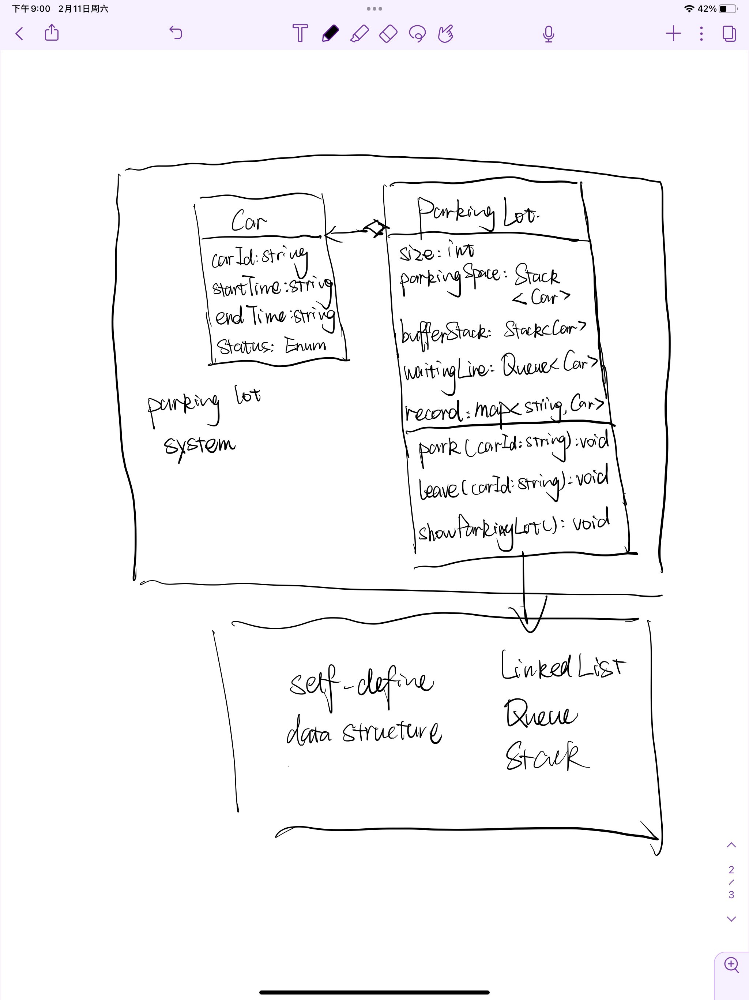

# ScenicSpotCPP

This is a simple data structure project of scenic spot management system. 

It's written in C++, I re-organized this project, changed it from Java to C++. 

This Project contains two main subsystem: scenic spot management system and scenic spot parking lot management system. 

## Scenic Spot Management System

- Scenic spot management system: This is a graph project. 
  - Users can see routes between spots(adjacency matrix)
    - 
  - search spot information
    - 
  - see the ranking of the popularity between spots
    - 
  - find shortest path between two spots
    - 
  - see the guidance path.
    - 
  - see the full spot list
    - 
  - see the path list
    - 

This is the class diagram of the graph management system.

- Sorting algorithm includes: bubble sort, insertion sort, selection sort, insertion sort, merge sort, quicksort, shell sort
- Shortest path algorithm includes: Dijkstra, Floyd
- MST algorithm includes: Prim(implemented but not used here, find a better one to implement the guidance map), DFS to find hamilton circuit

## Parking lot System

parking lot system includes

- park the car

  - If the parking lot is not full

    

  - If the parking lot is full, all cars will go to the waiting line

    

- leave the parking lot
  - 
- show current status of the parking lot
  - 

This is the class digram of the parking lot system.

The parking lot has 3 data structure 

- parking space: this is the place where car park.
- buffer stack: This is the buffer when parking lot is full,  it will be used to store the car that should not be out of the parking lot.
- waiting line: when parking lot is full, car will be stay in line
- record: used to find car more quickly.

The car has three status: INLOT, OUTLOT, WAITING. Use the enum class to better manipulate the car. 

